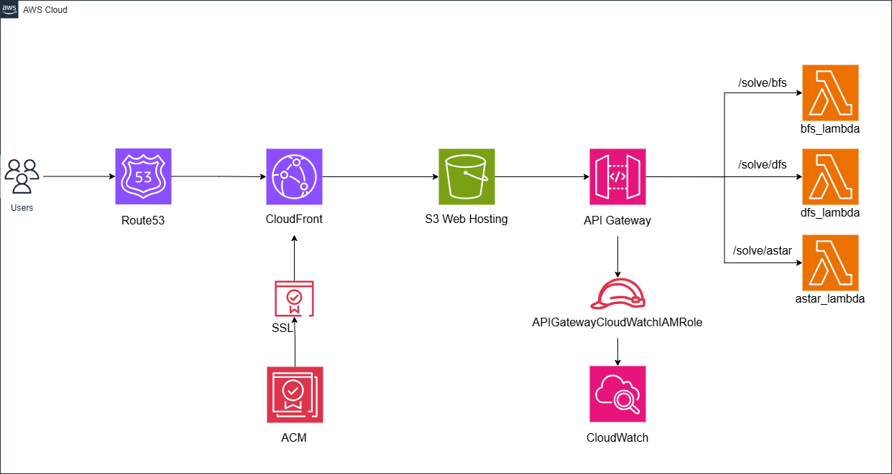

# Serverless Graph Search Visualizer (Maze Solver)



## 📖 Overview

The **Serverless Graph Search Visualizer** is a cloud-native web application designed to demonstrate pathfinding algorithms on a grid maze. It helps users visualize how different algorithms explore a search space to find the shortest path between a specific start and end node.

This project is built using a fully **Serverless** architecture, hosting a static frontend on **AWS S3** served via **CloudFront**, and interacting with a scalable backend powered by **API Gateway** and **AWS Lambda**.

---

## 🏗️ Architecture

The application follows a modern serverless microservices pattern:

1.  **Frontend Delivery:** The user accesses the web interface via a custom domain managed by **Route53**. The static assets (`index.html`, `script.js`, CSS) are stored in an **S3 Bucket** and delivered globally with low latency using **AWS CloudFront** CDN.
2.  **API Gateway:** User requests (e.g., "Solve Maze using BFS") are sent to an **AWS API Gateway** (HTTP API), which acts as the unified entry point for the backend.
3.  **Microservices (AWS Lambda):** The backend logic is decoupled into separate **AWS Lambda** functions for each algorithm:
    *   `BFS_Function`: Handles Breadth-First Search.
    *   `DFS_Function`: Handles Depth-First Search.
    *   `AStar_Function`: Handles A* Search.
4.  **Lambda Layers:** To adhere to the **DRY (Don't Repeat Yourself)** principle, shared logic (such as grid validation and neighbor calculation) is packaged into an **AWS Lambda Layer**. This layer is attached to all algorithm functions, ensuring code reusability and easier maintenance.

**Data Flow:**
`User Client` ➔ `Route53` ➔ `CloudFront` ➔ `S3 (Frontend)` ➔ `API Gateway` ➔ `Lambda Functions (Backend)`

---

## 🛠️ Tech Stack

### Frontend
*    **HTML5**
*    **CSS3**
*    **JavaScript (Vanilla)**
*    **Bootstrap 5**

### Cloud & DevOps (AWS)
*   **AWS S3** (Static Hosting)
*   **AWS CloudFront** (CDN)
*   **AWS Route53** (DNS)
*   **AWS API Gateway** (REST/HTTP API)
*   **AWS Lambda** (Serverless Compute - Python 3.x)
*   **AWS Lambda Layers** (Dependency Management)

### Algorithms
*   **Breadth-First Search (BFS)**: Guarantees the shortest path in unweighted graphs.
*   **Depth-First Search (DFS)**: explores as far as possible along each branch before backtracking (not guaranteed shortest path).
*   **A* Search (A-Star)**: Uses heuristics to find the shortest path more efficiently.

---

## ✨ Features

*   **Responsive Grid Design:** A dynamic grid that fits various screen sizes using Bootstrap.
*   **Real-time Visualization:** Watch the algorithms "thinking" as they animate visited nodes in blue and the final path in yellow.
*   **Interactive Obstacles:** Click and drag on the grid to add walls/obstacles that the algorithms must navigate around.
*   **Algorithm Comparison:** visually compare the behavior of BFS, DFS, and A* to see differences in efficiency and path optimality.

---

## 📂 Project Structure

```text
Serverless Graph Search Visualizer/
├── Application/
│   ├── AWS Lambda Layer/       # Shared Python modules (Helper functions)
│   ├── Lambda Functions/
│   │   ├── bfs_solver.py       # Breadth-First Search logic
│   │   ├── dfs_solver.py       # Depth-First Search logic
│   │   └── astar_solver.py     # A* Search logic
│   ├── index.html              # Main frontend interface
│   └── script.js               # Frontend logic & API calls
├── ServerlessAPP.png           # Architecture Diagram
├── README.md                   # Project Documentation
└── LICENSE
```

---

## 🔌 API Reference

The backend exposes a RESTful API via AWS API Gateway to solve the maze.

### `POST /solve/{algorithm}`
Solves the maze using the specified algorithm.

**Parameters:**
*   `algorithm`: The name of the algorithm (`bfs`, `dfs`, `astar`).

**Request Body (JSON):**
```json
{
  "startNode": 10,
  "endNode": 99,
  "walls": [12, 22, 32, 42]
}
```
*   `startNode`: integer index of the starting cell.
*   `endNode`: integer index of the destination cell.
*   `walls`: array of integer indices representing obstacles.

**Response (JSON):**
```json
{
  "visited": [10, 11, 20, 21, ...],
  "path": [10, 20, 30, ... 99],
  "status": "success"
}
```
*   `visited`: Ordered list of nodes visited during the search (for animation).
*   `path`: The calculated path from start to end.
*   `status`: Outcome of the operation.

---

## 🚀 How to Run

### Live Demo
The application frontend is deployed and available live at:
**[zaher.online](https://zaher.online)** _(Replace with actual URL if different)_

### Local Development
Since the backend is serverless, you cannot "run" the backend locally without emulating AWS Lambda (e.g., using SAM CLI). However, you can run the frontend:

1.  Clone the repository.
2.  Navigate to the `Application/` folder.
3.  Open `index.html` in your web browser.
    *   *Note: The frontend allows CORS requests to the deployed AWS API Gateway, so it should function correctly even from localhost.*
